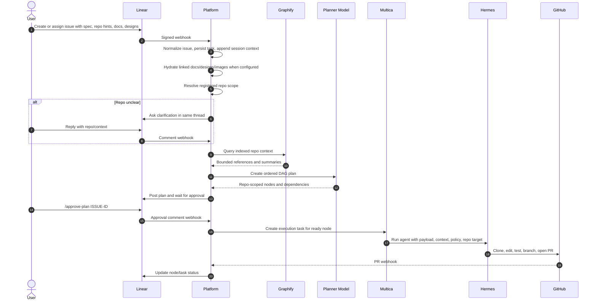

# Agentic SDLC Platform

Self-hosted control plane for turning product requests into planned, approved, repo-scoped agent
work.

The platform connects Linear, Slack, Telegram, GitHub, Graphify, Multica, Hermes, and model
providers behind one company-neutral FastAPI service. The open-source repo contains no company
specific configuration; each organization brings its own GitHub App, Linear workspace, model keys,
and repo registrations through ignored local config or a secret manager.

## What It Does

- Receives work from Linear, Slack, Telegram, or direct API calls.
- Hydrates request context from issue descriptions, comments, markdown attachments, docs, designs,
  and images when credentials are configured.
- Resolves which registered repo or repos the request belongs to.
- Uses GraphStore-first repo context retrieval, with Graphify as the first real adapter.
- Produces an implementation plan as a DAG: ordered, repo-scoped nodes with dependencies.
- Waits for explicit plan approval before write execution.
- Sends ready nodes to Multica/Hermes for execution.
- Tracks PR URLs, node state, retry state, conversation context, usage, and cost metadata.
- Updates task state from GitHub PR webhooks as PRs open, update, merge, or close.

A DAG is the platform's execution plan: a graph of work nodes where each node has a repo, a task,
and dependencies that must finish before it can run.

## Architecture

```mermaid
flowchart LR
    user[User] --> channels[Linear / Slack / Telegram]
    channels --> ingress[Platform Webhooks]
    ingress --> session[Session + Task Store]
    session --> hydrate[Spec Hydration]
    hydrate --> docs[Notion / Google Docs / Figma / Images]
    hydrate --> scope[Repo Scope Resolver]
    scope --> graph[GraphStore / Graphify]
    graph --> planner[Planner Model]
    planner --> dag[DAG Planner + Approval Gate]
    dag --> multica[Multica]
    multica --> hermes[Hermes Runtime]
    hermes --> github[GitHub App / Clone / Branch / PR]
    github --> prhook[GitHub PR Webhook]
    prhook --> session
    session --> channels
```

## Request Flow



## Runtime Boundaries

| Component | Responsibility |
| --- | --- |
| Platform | Webhooks, auth, session storage, repo registration, planning, approval, DAG state, observability |
| GraphStore / Graphify | Build and query repo indexes so every agent run starts from bounded code context |
| Multica | Execution coordination and task/runtime tracking |
| Hermes | Agent runtime that performs repo work through the selected model/provider |
| GitHub App | Repo read/write access, branch creation, PR creation, PR webhook updates |
| Linear / Slack / Telegram | User-facing conversation and task operations |

## Quick Start

```bash
uv sync
make quality
make migrate
uv run agentic-sdlc-platform
```

For Docker-based organization setup:

```bash
cp .env.example .env.local
make compose-real-hermes-up
```

Then verify:

```bash
curl http://localhost:8080/healthz
curl http://localhost:8080/readyz
curl http://localhost:8080/ops/status
```

Full Docker onboarding is documented in
[Docker Compose Organization Setup](docs/DOCKER_ORG_SETUP.md). The repeatable operator checklist is
in [Self-Hosted Bootstrap Runbook](docs/SELF_HOSTED_BOOTSTRAP_RUNBOOK.md).

## Required Setup

Minimum useful setup for an organization:

1. Create one GitHub App for repo access.
2. Give it repository permissions for `Contents: Read & Write`, `Pull requests: Read & Write`,
   `Issues: Read & Write`, `Checks: Read`, and metadata read access.
3. Set its webhook URL to `https://<platform-host>/webhooks/github`.
4. Install the app into the GitHub organization and select the repos it may access.
5. Configure Linear webhook delivery to `https://<platform-host>/webhooks/linear`.
6. Add OpenAI or another model provider key.
7. Start the Docker stack.
8. Sync the GitHub App installation into the platform.
9. Register/index repos.
10. Assign a Linear issue or create a task through the API.

Secrets belong in `.env.local` for local Docker or in your deployment secret manager. Do not commit
private keys, API keys, installation tokens, repo indexes, or hydrated artifacts.

## Key Environment Variables

```bash
# Core
ASDLC_ENVIRONMENT=local
ASDLC_VENDOR_HTTP_ENABLED=true

# GitHub App
ASDLC_GITHUB_APP_SLUG=<github_app_slug>
ASDLC_GITHUB_APP_ID=<github_app_id>
ASDLC_GITHUB_APP_INSTALLATION_ID=<installation_id>
ASDLC_GITHUB_APP_PRIVATE_KEY_PATH=secrets/github-app.pem
ASDLC_GITHUB_WEBHOOK_SECRET=<github_webhook_secret>
ASDLC_GITHUB_APP_WRITE_ENABLED_DEFAULT=true

# Linear
ASDLC_LINEAR_SIGNING_SECRET=<linear_webhook_secret>
ASDLC_LINEAR_SPEC_PLANNER_ENABLED=true
ASDLC_LINEAR_PLAN_APPROVAL_REQUIRED=true

# Model routing
ASDLC_MODEL_PROVIDER=openai
ASDLC_OPENAI_API_KEY=<openai_api_key>
ASDLC_OPENAI_DEFAULT_MODEL=gpt-5-mini
ASDLC_OPENAI_ROUTER_MODEL=gpt-5-nano
ASDLC_OPENAI_PLANNER_MODEL=gpt-5-mini
ASDLC_OPENAI_WRITE_MODEL=gpt-5-mini
ASDLC_OPENAI_WRITE_ESCALATION_MODEL=gpt-5

# Multica + Hermes
ASDLC_MULTICA_HTTP_ENABLED=true
ASDLC_MULTICA_BASE_URL=<multica_url>
ASDLC_MULTICA_API_KEY=<multica_pat>
ASDLC_MULTICA_WORKSPACE_ID=<workspace_id>
ASDLC_HERMES_HTTP_ENABLED=true
ASDLC_HERMES_API_KEY=<hermes_api_key>

# Graphify
ASDLC_GRAPHIFY_MODE=cli
ASDLC_GRAPHIFY_COMMAND=graphify
```

See `.env.example` and [Docker Compose Organization Setup](docs/DOCKER_ORG_SETUP.md) for the full
configuration surface.

## API Pointers

| Flow | Endpoint |
| --- | --- |
| Health | `GET /healthz`, `GET /readyz`, `GET /ops/status` |
| GitHub App install URL | `GET /repos/github-app/install-url?workspace_id=<id>` |
| GitHub App repo sync | `POST /repos/github-app/sync` |
| Register repo | `POST /repos` |
| Index repo | `POST /repos/{repo_name}/index` |
| Ask repo question | `POST /repos/{repo_name}/ask` |
| List tasks | `GET /tasks` |
| Task details | `GET /tasks/{task_id}` |
| DAG details | `GET /tasks/{task_id}/dag/{dag_id}` |
| Usage ledger | `GET /tasks/{task_id}/llm-observability` |
| Linear webhook | `POST /webhooks/linear` |
| GitHub webhook | `POST /webhooks/github` |

## Development

```bash
make quality
make contract
uv run pytest -q
```

The project is test-first. Unit tests cover the core orchestration and adapters; Schemathesis
contract tests exercise the FastAPI OpenAPI surface. See [TDD Workflow](docs/TDD_WORKFLOW.md) for
the development loop.

## Documentation

- [Docker Compose Organization Setup](docs/DOCKER_ORG_SETUP.md)
- [Self-Hosted Bootstrap Runbook](docs/SELF_HOSTED_BOOTSTRAP_RUNBOOK.md)
- [Implementation Backlog](docs/IMPLEMENTATION_BACKLOG.md)
- [TDD Workflow](docs/TDD_WORKFLOW.md)
- Agent/runtime instructions: `AGENTS.md`, `CLAUDE.md`, `.agent/`
